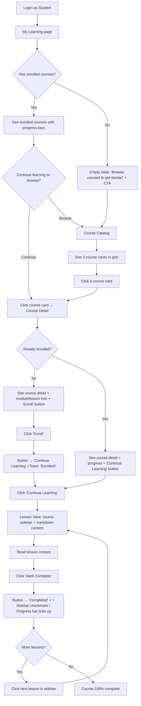
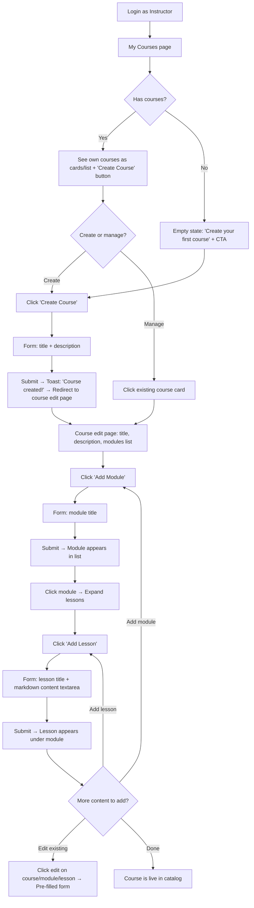
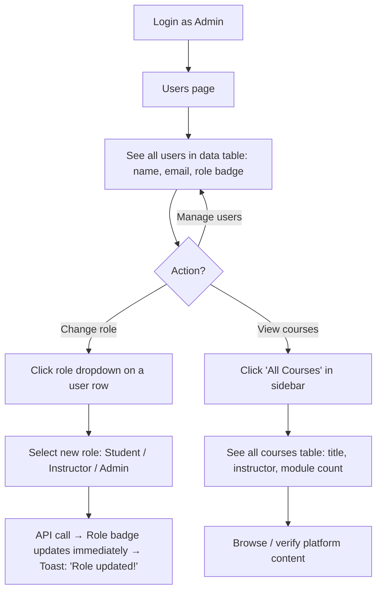
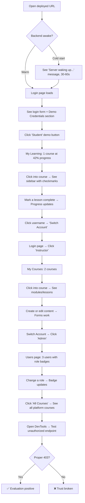

---
stepsCompleted:
  - 1
  - 2
  - 3
  - 4
  - 5
  - 6
  - 7
  - 8
  - 9
  - 10
  - 11
  - 12
  - 13
  - 14
lastStep: 14
completedAt: '2026-03-24'
inputDocuments:
  - planning-artifacts/prd.md
---

# UX Design Specification — LMS

**Author:** Berdyshevo
**Date:** 2026-03-24

---

## Executive Summary

### Project Vision

A demo Learning Management System designed to demonstrate full-stack NestJS proficiency to a CTO and senior developer audience. The UX serves dual purposes: providing a believable, functional learning platform for three user roles (Student, Instructor, Admin), while simultaneously creating a polished first impression that communicates architectural competence and product thinking. The interface must be self-explanatory — the interviewer will explore freely without guidance, so the design and seed data must tell their own story.

### Target Users

**Primary (in-app):**
- **Student (Алексей)** — Browses courses, enrolls, reads markdown lessons, tracks completion progress. Needs: clear catalog, smooth enrollment flow, satisfying progress feedback.
- **Instructor (Марина)** — Creates and manages courses, modules, and lessons. Needs: efficient content creation workflow, scoped view of own courses only.
- **Admin (Олег)** — Manages users and oversees all platform content. Needs: user list with role assignment, all-courses overview.

**Meta-user (the real audience):**
- **CTO / Senior Developer** — Evaluates the running application and codebase. Clicks around freely across all roles. Needs: polished UI that signals product thinking, obvious role differentiation, working seed data that demonstrates all features without explanation.

### Key Design Challenges

1. **Self-narrating experience** — No guided demo. Seed data must tell a complete story (student mid-course, instructor with real content, clear role differences). Login page must make role-switching trivial.
2. **Unified multi-role UI** — Three distinct role experiences sharing consistent visual language and navigation patterns. Role boundaries must be immediately obvious without feeling like separate applications.
3. **Every page must stand alone** — The interviewer may land on any page first. Each view needs enough context (page titles, breadcrumbs, contextual data) to be immediately understandable within 2 seconds, without prior navigation.
4. **Polish on a 1-day budget** — Leveraging shadcn/ui (Radix + Tailwind) for a modern baseline. Polish expressed through consistent spacing, clear visual hierarchy, and thoughtful states (empty, loading) rather than custom flourishes. shadcn/ui *is* the polish — use it as-is.
5. **Responsive design** — Desktop-first but mobile-decent. The interviewer may check on a phone to gauge attention to detail.

### Design Opportunities (ordered by ROI)

1. **Demo credential showcase** — One-click role switching on the login page. Lowest effort, highest friction removal. 20 minutes to build, saves every evaluator 2 minutes of friction. Displays seed accounts with visible roles: `admin@lms.com (Admin)`.
2. **Role-aware navigation** — Adaptive sidebar where nav items change per role. Demonstrates RBAC working at the UI level before the interviewer opens code. Developer-legible folder structure (`/courses`, `/users`, `/auth`), user-legible labels ("Browse Courses," "My Learning," "Users").
3. **UI architecture as code architecture signal** — Frontend navigation and page structure mirror NestJS module boundaries (Auth, Users, Courses, Enrollments, Progress). The interviewer sees the same structure in the sidebar and in `backend/src/`.
4. **Progress visualization as hero moment** — A styled shadcn Progress component showing course completion percentage. Small detail that signals UX awareness and product thinking.
5. **Opinionated empty states** — "No courses yet — create your first one" with a clear CTA. Shows full lifecycle thinking. Seed data covers the happy path; empty states cover the "I want to poke around" path.
6. **Breadcrumbs as domain hierarchy signal** — `Courses > NestJS Basics > Module 1 > Lesson 3` shows entity relationships through the UI. A CTO reads the breadcrumb and sees the data model.
7. **Seed data as UX design** — Realistic course titles ("NestJS Basics"), meaningful module names ("Getting Started," "Core Concepts," "Building APIs"), a student at ~42% progress. The seed data *is* the demo — lorem ipsum would undermine everything.

### UX Build Budget

| UX Item | Time | Priority |
|---|---|---|
| Login page + demo credentials | 30 min | P0 |
| Layout shell (sidebar, role-aware nav) | 45 min | P0 |
| Course catalog (card grid) | 30 min | P0 |
| Course detail + enrollment | 30 min | P0 |
| Lesson view (markdown + complete btn) | 30 min | P0 |
| My Learning (enrolled + progress bars) | 30 min | P0 |
| Instructor: My Courses + create/edit | 45 min | P0 |
| Admin: Users table + role dropdown | 30 min | P0 |
| Admin: All Courses table | 15 min | P0 |
| Breadcrumbs | 20 min | P1 |
| Empty states (3-4 pages) | 20 min | P1 |
| Responsive polish pass | 20 min | P1 |
| Seed data crafting | 30 min | P0 |
| **Total** | **~6 hrs** | |

## Core User Experience

### Defining Experience

The core experience is optimized for the **interviewer evaluation flow**, not traditional end-user engagement. The primary interaction loop is: log in as a role → explore that role's capabilities → switch to another role → compare the differences. The secondary loop (the one that makes the demo believable) is the student learning flow: browse catalog → enroll → read lessons → mark complete → watch progress grow.

The product's value is demonstrated through the *contrast between roles* — the same application presenting three distinct, properly scoped experiences. This contrast is the demo's centerpiece, and it should be **discoverable through exploration**, not announced with banners.

### Platform Strategy

- **Platform:** Web-only SPA (React + NestJS API)
- **Input:** Mouse/keyboard primary, touch as secondary (mobile-decent)
- **Offline:** Not required
- **Device features:** None — standard browser capabilities only
- **Browser support:** Modern evergreen browsers (Chrome, Firefox, Safari, Edge — latest 2 versions)
- **Hosting constraint:** Render free tier — backend sleeps after 15 min inactivity, cold start takes 30-60 seconds. This is a UX-critical deployment detail.

No platform complexity. The entire UX budget goes toward interaction quality, not platform adaptation.

### Effortless Interactions

1. **Role switching** — One-click demo credentials on the login page. The interviewer should switch from Student to Admin to Instructor in under 5 seconds each time. No typing emails, no remembering passwords. This is the most-repeated action during evaluation and must be frictionless.
2. **Course hierarchy navigation** — Catalog → Course → Module → Lesson should feel like one continuous flow. Breadcrumbs provide constant orientation. Back navigation is always predictable. The hierarchy never feels like "a series of page loads" — it feels like drilling into content.
3. **Role-appropriate context** — When you log in, the sidebar, page content, and available actions immediately reflect your role. No confusion about what you can do. No hidden menus. No "why can't I click this?" moments. The contrast is discovered through exploration, not announced.
4. **Cold start resilience** — On first visit, if the backend takes more than 3 seconds to respond, show an honest message: "Server is waking up (free tier hosting) — this takes ~30 seconds on first visit." This demonstrates infrastructure awareness and prevents the interviewer from thinking the app is broken.

### Critical Success Moments

1. **The cold start moment** (first contact) — The interviewer opens the URL. Render free tier may need 30-60 seconds to wake up. If the login page handles this gracefully with a clear status message, the evaluation starts with a positive signal. If it shows a blank page or silent spinner, the interviewer assumes the app is broken before it begins.
2. **The role switch moment** (make-or-break) — The interviewer logs in as Student, sees student nav. Logs in as Admin, sees admin nav. *Different pages, different capabilities, same clean UI.* If this contrast is crisp, the demo succeeds. If roles leak or the UI doesn't adapt, the demo fails. This is the single most important UX moment.
3. **The boundary test moment** (developer UX) — The interviewer will open DevTools. They will hit `/api/users` as a Student. A clean `403 Forbidden` with a consistent JSON error response is UX for the developer audience. Silent data leaks or generic 500 errors undermine the entire RBAC story.
4. **The progress moment** — Student marks a lesson complete, progress bar moves. Simple cause-and-effect that proves the system is real, not a static mockup.
5. **The content creation moment** — Instructor creates a course, adds a module, writes a lesson. The form works, the content appears. Proves full CRUD is functional.

### Experience Principles

1. **Role contrast is the product** — Every design decision should amplify the visible difference between Student, Instructor, and Admin experiences. The contrast should be discoverable through exploration, not announced with labels or banners. The interviewer *notices* the differences — that's more impressive than being told.
2. **Zero-friction evaluation** — The interviewer is not a patient user. Every click should reward with immediate, clear feedback. No loading spinners longer than 1 second (except cold start, which is handled honestly). No dead ends. No ambiguity. Consistent error responses when testing unauthorized access.
3. **Navigation as architecture proof** — The UI structure (sidebar items, routes, breadcrumbs) should be legible as a reflection of the backend module structure. Frontend route naming should rhyme with `backend/src/` module names: `/courses` ↔ `src/courses/`, `/admin/users` ↔ `src/users/`, `/auth` ↔ `src/auth/`.
4. **Considered over impressive** — The demo doesn't need novel interactions or animations. It needs to show that every small decision was intentional: meaningful copy, helpful empty states, current-page indicators in the nav, specific error messages, breadcrumbs nobody asked for. The small things signal product maturity. "Considered" is what makes a CTO think "this person would make good product decisions on our team."

## Desired Emotional Response

### Primary Emotional Goals

**For the interviewer (the real audience):**
- **"This person thinks like a product engineer"** — Not just technically competent, but someone who makes intentional product decisions. Every UI detail should feel chosen, not defaulted.
- **"I want this person on my team"** — The lingering feeling after exploration. The app should leave the impression of working with someone who ships considered, complete work.

**For the in-app users:**
- **Momentum** — Алексей feels progress. Every lesson completed, every percentage point gained creates forward energy. The system rewards continued engagement.
- **Ownership** — Марина feels her courses are *hers*. The scoped view, the create/edit flows, the "My Courses" label — she's building something.
- **Control** — Олег feels the platform is manageable. Clear user list, simple role changes, full visibility. No surprises.

**The unifying thread:** Both audiences should feel **confidence** — the interviewer, confidence in the developer; the users, confidence in the platform.

### Emotional Journey Mapping

| Moment | Interviewer Feels | In-App User Feels |
|---|---|---|
| First load (cold start) | "They handled this gracefully — aware of infra" | "It's loading, it told me why" |
| Login page | "Demo accounts — they built this for me to explore" | "I can get in easily" |
| First page after login | "Clean, immediately understandable" | "I know where I am and what I can do" |
| Role switch | "Authorization works — this is real" | N/A (users don't switch roles) |
| Course catalog | "Good data, well-structured cards" | "I can find what I want" |
| Lesson completion | "Progress tracking works end-to-end" | "Satisfying — I'm moving forward" |
| Course creation (instructor) | "Full CRUD, clean forms" | "I built something" |
| Error / unauthorized access | "Proper 403, consistent format — they get security" | "Clear message, I know what happened" |
| Empty state | "They thought about this case too" | "I know what to do next" |

### Micro-Emotions

**Critical to get right:**
- **Confidence over confusion** — Every page, every interaction should feel immediately understandable. If the user hesitates even once wondering "what does this button do?" — we've failed.
- **Accomplishment over frustration** — Progress tracking, successful form submissions, role switches that work — these should all deliver small dopamine hits of "yes, that worked."
- **Trust over skepticism** — Consistent behavior, proper error handling, predictable navigation. The interviewer should never think "I wonder if this other thing works too..." with doubt.

**Must avoid:**
- **Rushed** — This is the #1 emotion to prevent. If anything feels hastily assembled — misaligned elements, placeholder text, inconsistent spacing, broken edge cases — the entire "product engineer" narrative collapses. The interviewer's takeaway becomes "they hacked this together." shadcn/ui prevents most of this by providing a consistent design baseline, but layout decisions, copy, and states still need intentional care.

### Design Implications

| Emotional Goal | UX Design Approach |
|---|---|
| "Not rushed" | Use shadcn/ui consistently. No custom CSS hacks. Consistent spacing via Tailwind utilities. No lorem ipsum anywhere. |
| Confidence | Breadcrumbs on every nested page. Active nav item highlighted. Page titles that match nav labels. |
| Momentum (student) | Progress bar updates immediately on lesson completion. Percentage shown on My Learning cards. |
| Ownership (instructor) | "My Courses" scoped view. Course count shown. Create button always visible. |
| Control (admin) | Data tables with clear columns. Role badges with color coding. Inline role change dropdown. |
| Trust | Consistent error message format. Proper HTTP status codes surfaced as friendly messages. No silent failures. |
| "Product engineer" | Empty states with helpful CTAs. Realistic seed data. Breadcrumbs. Current-page indicator in nav. |

### Emotional Design Principles

1. **Confidence is the baseline** — Every interaction must reinforce the user's sense of "I know what's happening." Confusion is the enemy. If a design choice creates even momentary uncertainty, simplify it.
2. **Never feel rushed** — This is the project's emotional red line. Better to have fewer features that feel polished than more features that feel hastily assembled. When in doubt, cut scope before cutting care.
3. **Small signals, big impressions** — The interviewer won't remember flashy features. They'll remember that the empty state had a helpful message, that the breadcrumb was there, that the error response was properly formatted. These "considered" moments compound into the feeling of "I want this person on my team."
4. **Reward every action** — Lesson marked complete? Progress bar moves. Course created? It appears in the list. Role changed? The badge updates. Every user action should produce visible, immediate feedback. No silent successes.

## UX Pattern Analysis & Inspiration

### Inspiring Products Analysis

**Coursera** — The primary UX inspiration for LMS. Coursera excels at making structured learning content navigable and trackable. Key strengths:

- **Course catalog** — Card grid layout with clear visual hierarchy (title, instructor, description). Scannable in seconds. Users decide quickly whether to explore further.
- **Course detail** — Strong information hierarchy: description and learning objectives at top, full syllabus breakdown below, persistent enrollment CTA. Users know exactly what they're committing to.
- **Learning sidebar** — Inside a course, a sidebar displays the complete module → lesson hierarchy with completion checkmarks. Constant orientation — the learner always knows where they are and what's next.
- **Progress visualization** — Progress indicators on "My Learning" cards create momentum. Visual feedback on completion drives continued engagement.
- **Two-tier navigation** — Minimal top-level nav (Browse, My Learning) with course-level sidebar taking over during learning. Navigation levels never compete for attention.

### Transferable UX Patterns

**Navigation Patterns:**
- **Card grid catalog (designed for 3)** — Course browsing via card layout (title, instructor, description). 3-column grid on desktop filling the viewport, single column on mobile. Designed for exactly 2-3 seed courses — no search bar, no filters, no pagination that implies more content. 3 cards should look intentional, not sparse.
- **Content sidebar with hierarchy** — Module → Lesson tree with completion indicators. Appears in two modes: read-only on course detail (pre-enrollment preview of content structure) and interactive on lesson view (with completion tracking). Built as a reusable `CourseSidebar` component — same structure, two modes. Demonstrates component architecture to the code reviewer.
- **Adaptive navigation model** — Global role-aware sidebar for app-level navigation. When inside a course, global sidebar collapses or becomes minimal — course sidebar takes over. Never show two full sidebars simultaneously.

**Interaction Patterns:**
- **One-click enrollment** — Single "Enroll" button, immediate access. No forms, no confirmations. Improves on Coursera's subscription friction.
- **Completion checkmarks** — Visual check icon on completed lessons in the sidebar. Instant feedback, satisfying to accumulate. Uses lucide-react Check icon.
- **Progress bar on course cards** — Percentage complete shown on My Learning cards. Creates the momentum micro-emotion. shadcn Progress component — one-liner.

**Visual Patterns:**
- **Clean card design** — Minimal information per card: title, instructor name, brief description, lesson count. No badge overload. Lean and scannable.
- **Active item highlighting** — Current lesson highlighted in the course sidebar. Current nav item highlighted in the global sidebar. User always knows "I am here."
- **Syllabus tree on course detail** — Module/lesson structure visible before enrollment. Shows information architecture thinking, helps the interviewer see the content hierarchy before committing.

### Anti-Patterns to Avoid

1. **Designing for scale we don't have** — No search bar, no filter dropdowns, no "Load more" buttons. 3 courses is the dataset. Design for 3 to look complete, not for 1000 to look paginated.
2. **Information overload on course detail** — No ratings, prerequisites, time estimates, certificates, reviews, enrollment counts. Title, description, instructor, module/lesson tree, enroll button. Clean and sufficient.
3. **Complex enrollment friction** — No subscription gates, trial periods, or multi-step flows. One click, immediate access.
4. **Sidebar-ception** — Never show global nav sidebar and course content sidebar simultaneously at full width. When inside a course, the global nav yields to the course context.
5. **Silent state changes** — Every action produces visible feedback. No background progress updates without UI response.
6. **Deep nesting without orientation** — Prevented by: persistent breadcrumbs + sidebar with current-item highlighting + clear page titles.

### Design Inspiration Strategy

**What to Adopt (directly):**
- Card grid for course catalog — proven, expected pattern for content browsing
- Sidebar lesson tree with checkmarks — Coursera's strongest learning UX pattern
- Progress bars on enrolled course cards — momentum visualization
- Active item highlighting in navigation — constant orientation

**What to Adapt (modify for our context):**
- Coursera's catalog (designed for scale) → our catalog designed for exactly 3 courses
- Coursera's top nav → our role-aware sidebar nav (multi-role is our unique twist)
- Coursera's heavy course detail → our lean course detail with syllabus tree preview
- Coursera's separate instructor app → our unified role-switching experience
- Coursera's learning sidebar → our reusable `CourseSidebar` component (read-only + interactive modes)

**What to Avoid:**
- Scale-implying UI for a small dataset — conflicts with "considered" principle
- Badge/rating/count overload — conflicts with "not rushed" emotional goal
- Complex enrollment flows — conflicts with "zero-friction evaluation" principle
- Dual sidebar layout — creates visual clutter, feels overengineered

**Competitive Positioning:**
These pattern choices are deliberate differentiators against typical portfolio LMS projects:

| Typical Demo Project | Our LMS |
|---|---|
| Bootstrap / Material UI | shadcn/ui — modern, clean, accessible |
| Single role (student only) | Three roles with one-click switching |
| Empty database, interviewer creates data | Pre-loaded seed data, immediate exploration |
| No UX consideration | Coursera-quality patterns the interviewer recognizes |
| Basic CRUD forms | Considered details: empty states, breadcrumbs, error responses |

The interviewer has seen other candidates' demos. These choices ensure ours doesn't look like the rest.

## Design System Foundation

### Design System Choice

**shadcn/ui** (Radix UI primitives + Tailwind CSS) — a component library where components are copied into your project source code, not installed as npm dependencies.

### Rationale for Selection

1. **Speed** — Pre-built, copy-paste components. No wrapper abstractions. Each component is production-ready out of the box with minimal configuration.
2. **Code transparency** — Components live in `src/components/ui/`, fully inspectable. A CTO reviewing the codebase sees clean, readable component code — not opaque library imports.
3. **Accessibility built-in** — Radix UI primitives handle focus management, keyboard navigation, ARIA attributes, and screen reader support. WCAG AA compliance with zero extra effort.
4. **Tailwind integration** — Styling via utility classes. Consistent spacing, typography, and color through Tailwind config. No CSS-in-JS, no styled-components, no class name conflicts.
5. **AI-assisted workflow** — MCP server configured for AI-driven component scaffolding, accelerating the 1-day build timeline.
6. **Modern aesthetic** — Clean, minimal design language that reads as "professional product" not "tutorial project." Directly supports the "considered, not rushed" emotional goal.

### Implementation Approach

**Component installation:** One-command setup:

```bash
npx shadcn@latest init
npx shadcn@latest add card button progress table badge breadcrumb sidebar input textarea select accordion scroll-area skeleton form dropdown-menu separator label
```

**Toast:** Use `sonner` integration instead of shadcn's older toast component. Simpler API: one `<Toaster />` in the layout, then `toast.success("Enrolled!")` anywhere.

**Required components:**

| Component | Purpose |
|---|---|
| `Card` | Course catalog cards, enrolled course cards |
| `Button` | CTAs, enrollment, form actions, demo credential buttons |
| `Progress` | Course completion percentage bars |
| `Table` | Admin user list, admin all courses list |
| `Badge` | Role indicators (Student/Instructor/Admin), status labels |
| `Breadcrumb` | Navigation orientation: Course → Module → Lesson |
| `Sidebar` | Global role-aware navigation shell |
| `Input` / `Textarea` | Login, register, course/module/lesson forms |
| `Select` | Admin role assignment dropdown |
| `Accordion` | Module/lesson tree structure |
| `ScrollArea` | Course content sidebar scrolling |
| `Skeleton` | Loading states during API calls |
| `Form` + `Label` | Form state management (react-hook-form + zod validation) |
| `DropdownMenu` | User menu (avatar/name → Logout) |
| `Separator` | Visual dividers in sidebar nav groups and forms |
| `Sonner` | Action feedback notifications ("Enrolled!", "Lesson completed") |

### Customization Strategy

**Minimal customization — use defaults.** The goal is speed and consistency, not uniqueness.

- **Colors:** Default shadcn/ui theme (neutral palette). No custom brand colors needed for a demo.
- **Typography:** Default font stack. Clean and readable.
- **Spacing:** Tailwind's default spacing scale. Consistent `p-4`, `gap-4`, `space-y-4` throughout.
- **Dark mode:** Not in scope for MVP. Light mode only.

### Component Architecture

**Three-layer composition model:**

```
src/
  components/
    ui/              ← shadcn components (never modified)
    layout/          ← App shell, sidebar, navigation
      AppSidebar.tsx
      AppLayout.tsx
      Breadcrumbs.tsx
    course/          ← Course-domain components
      CourseCard.tsx
      CourseSidebar.tsx
      LessonContent.tsx
    common/          ← Shared composed components
      EmptyState.tsx
      RoleBadge.tsx
      DemoCredentials.tsx
```

- **`ui/`** — Raw shadcn primitives. Copied from registry, never modified. The foundation layer.
- **`layout/`** — App shell components that compose shadcn primitives into the navigation and page structure.
- **`course/`** — Domain-specific components that combine primitives into course-related UI.
- **`common/`** — Reusable composed components shared across pages.

This layering signals component architecture understanding to the code reviewer: primitives → compositions → domain components.

**Key custom components:**

| Component | Description | Priority |
|---|---|---|
| `AppSidebar` | Role-aware navigation. Reads from `useAuth` hook, renders different nav items per role. | P0 |
| `AppLayout` | Shell with sidebar + main content area + Toaster + Breadcrumbs. | P0 |
| `CourseSidebar` | Module/lesson tree with completion checkmarks. Build interactive mode first (lesson view, P0). Add read-only mode (course detail preview, P1) via `readonly` prop. | P0/P1 |
| `CourseCard` | Composed: Card + Badge + Progress. Used in catalog and My Learning. | P0 |
| `EmptyState` | Icon + message + CTA button. Reusable across all pages. | P1 |
| `RoleBadge` | Badge with role-based color coding (Student=blue, Instructor=green, Admin=red). | P0 |
| `DemoCredentials` | Three one-click login buttons with role labels on the login page. | P0 |
| `Breadcrumbs` | Dynamic breadcrumb from route params. | P1 |

**Role-aware logic pattern:** A `useAuth` hook provides `{ user, role, isAdmin, isInstructor, isStudent }`. Components consume this hook — never embed role logic directly. This is the React equivalent of NestJS guards, and the interviewer will see that architectural parallel.

## Defining Core Experience

### Defining Experience

**The role-switch sequence** is the hero interaction for the interviewer. Not a single click, but a cumulative sequence: Student → Instructor → Admin. After exploring all three roles, the interviewer has a complete mental model of the system. That's the moment they think "this person built a real product."

**The completion cascade** is the hero interaction for the student. Mark a lesson complete → button updates → sidebar checkmark appears → progress bar ticks up → persists on reload. Simple cause-and-effect that proves the system is real and state-aware.

Both heroes must be bulletproof. Everything else can be good. These must be flawless.

### User Mental Model

**The interviewer's mental model:** They approach this as an evaluator, not a user. They will:
- Try all three roles systematically
- Open DevTools and inspect network requests
- Test boundaries (access endpoints as wrong role)
- Look for inconsistencies between UI and API
- Compare the running app to the code structure

They expect a demo app to be shallow. Exceeding that expectation — with considered details, proper error handling, and consistent behavior — is what creates the "I want this person on my team" impression.

**The 5-minute evaluator:** Some interviewers have 5 minutes, not 15. The seed data must create a guided discovery trail without explicit guidance. Each role's default landing page should immediately present something interactive — no browsing or searching needed. The first thing they see is the thing to try.

**The student's mental model:** Linear progression through content. Browse → choose → commit → learn → complete. They expect the system to track their progress reliably and show it clearly. The mental model is Coursera-shaped: sidebar with lessons, checkmarks, progress percentage.

**The instructor's mental model:** Content creation tool. Create → structure → fill with content. They expect to see only their own courses, have clear CRUD flows, and see their content reflected in the catalog.

### Success Criteria

**Role-switch sequence:**
- Switch between any two roles in under 4 seconds (via "Switch Account" → login page → one-click credential)
- Each role's landing page is immediately understandable without prior context
- Navigation items change visibly between roles
- No auth state leaks between sessions
- No demo-only bypass code — single honest auth flow throughout

**State cleanup checklist (on "Switch Account"):**
- Call `POST /auth/logout` — server clears the httpOnly cookie
- Clear React auth context (`user`, `role`) from memory
- Clear any cached API responses (React Query cache, if used)
- Reset sidebar navigation state
- Do NOT clear: browser history (back button should still work)
- Redirect to `/login`

**Completion cascade (all within 1 second of clicking "Mark Complete"):**
- Button changes to "Completed" state immediately (optimistic UI)
- Course sidebar updates — lesson gets a checkmark
- Progress bar ticks up with recalculated percentage (client-side: `completedLessons / totalLessons * 100`)
- Progress persists on page reload (API call fires alongside local state update)
- My Learning page shows updated percentage on next visit (refetch on page mount)

**Enrollment state awareness:**
- Course detail page shows "Enroll" button if not enrolled
- Course detail page shows "Continue Learning" + progress indicator if already enrolled
- On enrollment: button changes to "Continue Learning" on the same page (no redirect). Toast: "Enrolled successfully!" Course appears in My Learning when student navigates there later.
- No duplicate enrollment possible — button state reflects current enrollment status

### Auth Architecture (httpOnly Cookies)

**Decision:** JWT stored in httpOnly cookie, not localStorage. A CTO will `grep` for `localStorage` — storing JWT there signals tutorial-level auth. httpOnly cookies signal production auth awareness.

**Server-side (NestJS):**

Login endpoint:
```
POST /auth/login → Response:
  - Set-Cookie: access_token=<jwt>; HttpOnly; Secure; SameSite=Lax; Path=/; Max-Age=86400
  - Body: { id, name, email, role }
```

Logout endpoint:
```
POST /auth/logout → Response:
  - Set-Cookie: access_token=; HttpOnly; Secure; SameSite=Lax; Path=/; Max-Age=0
```

Session validation:
```
GET /auth/me → Reads cookie, validates JWT, returns { id, name, email, role }
```

**Key decisions:**
- **`SameSite=Lax`** (not Strict) — allows top-level navigation from external links (interviewer clicking URL in email)
- **`Secure` by environment** — HTTPS in production (Render provides it), skip in development via `NODE_ENV` check
- **No CSRF token** — `SameSite=Lax` is sufficient for SPA-to-own-API communication. Adding CSRF would be overengineering.
- **No refresh tokens** — 24-hour expiry, single token. Refresh deferred to Phase 2 per PRD.

**CORS with credentials (critical):**
- Backend: `origin: 'http://localhost:3000'` (explicit, not `*`), `credentials: true`
- Frontend: every fetch/axios request includes `credentials: 'include'`
- **Common gotcha:** If login succeeds but subsequent API calls return 401, check CORS credentials configuration.

**Swagger cookie support:** Configure NestJS Swagger to send cookies with requests, or API documentation will not work for authenticated endpoints. The interviewer will test Swagger.

**`useAuth` hook on app mount:** Calls `GET /auth/me` to restore session state on page refresh. This is the correct production pattern — a CTO will look for it.

**Build time impact:** +45 minutes over localStorage approach. Worth it for the security signal.

### Novel UX Patterns

**All established patterns — no novel interactions needed.** The project's UX innovation is not in new interaction paradigms but in the *quality of execution* of proven patterns:

- Card grid for browsing (established — Coursera, Udemy)
- Sidebar lesson tree with checkmarks (established — Coursera)
- Progress bars on course cards (established — every LMS)
- Role-aware navigation (established — every SaaS admin tool)
- One-click demo credentials (uncommon but simple — no education needed)

**Our unique twist:** The "Switch Account" flow. Not a novel pattern, but a considered UX decision:
- User menu shows "Switch Account" (not just "Logout")
- Redirects to login page with demo credentials section auto-focused
- Demo credential buttons show role labels: `student@lms.com (Student)`
- No demo-only code paths — this is real auth with convenient pre-filled data

**Architectural principle: never build demo-only features that bypass real auth.** The codebase contains exactly one auth flow. Demo credentials are pre-filled data, not a separate code path. A CTO notices and respects this.

### Experience Mechanics

**Hero Flow 1: Role-Switch Sequence**

| Step | User Action | System Response | Time |
|---|---|---|---|
| 1. Initiate | Click username → "Switch Account" | Calls `POST /auth/logout`. Server clears httpOnly cookie. Clears React context, cache, sidebar state. Redirects to `/login`. | < 1s |
| 2. Choose role | Click demo credential button (e.g., "Admin") | Sends login request. Server sets httpOnly cookie. Response body returns user object. Stored in React context. | < 1s |
| 3. Land | Automatic redirect to role's default page | Sidebar shows role-appropriate nav items | < 1s |
| 4. Explore | Click through available pages | Each page shows role-scoped content | Ongoing |
| **Total switch time** | | | **~3s** |

**Hero Flow 2: Completion Cascade**

| Step | User Action | System Response | Time |
|---|---|---|---|
| 1. Read lesson | Scroll through markdown content | Content renders with proper formatting | Instant |
| 2. Mark complete | Click "Mark Complete" button | Button → "Completed" (optimistic). API call fires in background. | Instant |
| 3. Sidebar updates | (Automatic) | Lesson gets checkmark icon in course sidebar | < 200ms |
| 4. Progress updates | (Automatic) | Progress bar recalculates client-side, ticks up | < 200ms |
| 5. Persist | (Background) | API confirms completion. On any page reload, state is preserved. | < 500ms |

**Hero Flow 3: Enrollment**

| Step | User Action | System Response | Time |
|---|---|---|---|
| 1. Browse | View course catalog | Card grid with 3 courses | Instant |
| 2. Explore | Click course card | Course detail: title, description, module/lesson tree, "Enroll" button | < 1s |
| 3. Enroll | Click "Enroll" | Button → "Continue Learning" (same page, no redirect). Toast: "Enrolled successfully!" | < 1s |
| 4. Learn | Click "Continue Learning" | Navigates to first lesson with course sidebar | < 1s |

### Connective Experience

The non-hero interactions that hold the experience together. These are invisible when done right, and trust-destroying when done wrong.

**Page transitions:**
- SPA means no full page reloads. Content area updates while sidebar stays stable.
- No layout shift, no flash of unstyled content.

**Navigation feedback:**
- When clicking a sidebar item, the active state updates immediately, even before content loads. The user sees "I clicked" confirmation before seeing the result.

**Loading states:**
- If any API call takes more than 300ms, show a `Skeleton` placeholder.
- Never a blank page. Never a spinner in the middle of empty space.

**Back navigation:**
- Browser back button works predictably: Lesson → back → Course detail. Course detail → back → Catalog.
- No broken history states. React Router handles this natively with proper route structure.

### Seed Data as Guided Discovery

Each role's default landing page immediately presents something interactive. No browsing needed — the first thing the interviewer sees is the thing to try.

| Role | Landing Page | What They See First | Immediate Action |
|---|---|---|---|
| Student | My Learning | 1 course at ~42% progress (5/12 lessons) | "Continue this course" — click into it, see completed/uncompleted lessons |
| Instructor | My Courses | 2 courses owned, one showing enrollment count | Click into a course, see modules/lessons, edit content |
| Admin | Users | 3 users with different role badges | Change a role — badge updates immediately |

**Seed data targets:**
- 3 users: `admin@lms.com` (Admin), `instructor@lms.com` (Instructor), `student@lms.com` (Student). Password: `password123` for all.
- 2-3 courses created by the instructor, with realistic titles and module/lesson structure
- 1 enrollment: student enrolled in one course with ~42% progress (5 of 12 lessons completed)
- Lesson content: real markdown, not lorem ipsum — short technical content that reads as believable

## Visual Design Foundation

### Color System

**Strategy: shadcn/ui defaults — neutral palette with semantic accents.**

No custom brand colors. The demo's visual identity comes from clean structure and consistent spacing, not a color scheme.

| Token | Color | Usage |
|---|---|---|
| Background | `white` / `zinc-950` | Page background |
| Foreground | `zinc-950` / `zinc-50` | Primary text |
| Muted | `zinc-100` / `zinc-800` | Secondary backgrounds, subtle borders |
| Muted foreground | `zinc-500` | Secondary text, placeholders |
| Primary | `zinc-900` | Buttons, active nav items, links |
| Destructive | `red-500` | Delete actions, error states |
| Border | `zinc-200` | Card borders, dividers, input borders |

**Semantic accents (role badges and status):**

| Element | Color | Rationale |
|---|---|---|
| Student badge | `blue-500` | Trust, learning |
| Instructor badge | `green-500` | Growth, creation |
| Admin badge | `red-500` | Authority, caution |
| Success toast | `green-500` | Positive feedback |
| Error toast | `red-500` | Error feedback |
| Progress bar | `blue-500` | Momentum, forward movement |

**Why neutral:** A zinc-based palette reads as "professional SaaS tool." It doesn't scream "EdTech startup" — it says "this developer builds products that look like products." The interviewer sees a UI that could ship, not a themed demo.

### Typography System

**Strategy: system font stack — zero configuration, maximum compatibility.**

shadcn/ui uses `Inter` as the default via the system font stack. No custom font imports, no layout shift from font loading.

| Level | Size | Weight | Usage |
|---|---|---|---|
| h1 | `text-3xl` (30px) | `font-bold` | Page titles ("Course Catalog", "My Learning") |
| h2 | `text-2xl` (24px) | `font-semibold` | Section headers, course titles |
| h3 | `text-xl` (20px) | `font-semibold` | Module titles, card headers |
| h4 | `text-lg` (18px) | `font-medium` | Lesson titles, subsection headers |
| Body | `text-base` (16px) | `font-normal` | Descriptions, lesson content, form labels |
| Small | `text-sm` (14px) | `font-normal` | Metadata, timestamps, badge text |
| Caption | `text-xs` (12px) | `font-medium` | Helper text, progress percentages |

**Markdown rendering (lesson content):**
- Prose styling via `@tailwindcss/typography` plugin (`prose` class)
- Provides proper heading hierarchy, paragraph spacing, list styling, and code block formatting
- No custom CSS — the plugin handles all markdown elements

### Spacing & Layout Foundation

**Strategy: airy and spacious — let content breathe.**

| Token | Value | Usage |
|---|---|---|
| Page padding | `p-6` (24px) | Main content area padding |
| Section gap | `space-y-6` (24px) | Between major page sections |
| Card gap | `gap-6` (24px) | Between cards in grid layouts |
| Card padding | `p-6` (24px) | Internal card padding |
| Form gap | `space-y-4` (16px) | Between form fields |
| Inline gap | `gap-2` (8px) | Between inline elements (badge + text, icon + label) |

**Layout structure:**
- **Sidebar:** 256px width (`w-64`), fixed on desktop, collapsible on mobile
- **Main content:** Flexible width, max `max-w-5xl` for readability on wide screens
- **Course catalog:** 3-column grid on desktop (`grid-cols-3`), single column on mobile
- **Tables (admin):** Full width with horizontal scroll on mobile
- **Forms:** Single column, max `max-w-md` to prevent overly wide inputs

**Grid system:** Tailwind's built-in CSS grid. No custom grid framework. `grid-cols-1 md:grid-cols-2 lg:grid-cols-3` for responsive catalog.

### Accessibility Considerations

**Built-in via shadcn/ui (Radix UI):**
- Focus management and keyboard navigation on all interactive elements
- ARIA attributes auto-applied by Radix primitives
- Focus ring visible on keyboard navigation (`ring-2 ring-ring ring-offset-2`)

**Color contrast:**
- All text-on-background combinations meet WCAG AA (4.5:1 for normal text, 3:1 for large text)
- shadcn/ui's default zinc palette is pre-tested for AA compliance
- Role badge colors (blue, green, red) on white backgrounds meet AA standards
- Never use color alone to convey information — always pair with text or icons

**Typography accessibility:**
- Minimum body text: 16px (`text-base`) — never smaller for primary content
- 14px (`text-sm`) only for secondary metadata
- Line height: Tailwind defaults (1.5 for body, 1.25 for headings) — sufficient for readability

**Interactive element sizing:**
- Minimum touch target: 44x44px for buttons and interactive elements
- shadcn Button component meets this by default at regular size

## Design Direction Decision

### Design Directions Explored

Given the project constraints (1-day build, shadcn/ui defaults, Coursera-inspired patterns), the design direction converged naturally through our earlier decisions rather than requiring visual exploration of multiple alternatives. The visual foundation (neutral zinc palette, system fonts, airy spacing) combined with the established UX patterns (role-aware sidebar, card catalog, learning sidebar) define a single coherent direction.

### Chosen Direction

**"Clean SaaS Dashboard"** — Professional, minimal, structure-driven. Inspired by Linear, Vercel, and Notion's sidebar layout model rather than colorful EdTech platforms.

**Layout blueprint:**

| Page | Layout Structure |
|---|---|
| Login / Register | Centered card (`max-w-md`), login form on top, demo credentials section below with visual separation |
| Course Catalog | Page title + 3-column card grid (`grid-cols-3`), full viewport width |
| Course Detail | Full-width: title + description + instructor at top, module/lesson accordion tree below, "Enroll" or "Continue Learning" CTA prominent |
| Lesson View | Two-panel: course sidebar (left, `w-64`) with module/lesson tree + checkmarks, lesson content (center) with markdown rendering |
| My Learning (Student) | Page title + course cards with progress bars, similar layout to catalog but showing only enrolled courses |
| My Courses (Instructor) | Page title + "Create Course" button + course list/cards, scoped to own courses |
| Admin: Users | Page title + full-width data table with role badges and inline role dropdown |
| Admin: All Courses | Page title + full-width data table with instructor name and course details |

**Navigation behavior:**

| Context | Global Sidebar | Course Sidebar | Content Area |
|---|---|---|---|
| Outside a course | Full sidebar (`w-64`), role-aware nav items | Not visible | Full width |
| Inside a course (detail/lesson) | Collapsed to icon-only or hidden | Full sidebar (`w-64`) with module/lesson tree | Remaining width |

### Design Rationale

1. **"Clean SaaS" reads as professional.** The interviewer has seen colorful tutorial projects. A neutral, tool-like UI signals maturity.
2. **Single layout pattern, multiple pages.** Sidebar + content area is the only layout. No page has a unique structure. Consistency signals intentional design.
3. **Color is information, not decoration.** The only colored elements carry meaning: role badges (who), progress bars (how far), toast notifications (what happened). Everything else is zinc/white.
4. **Sidebar transition is the key visual moment.** When entering a course, the global sidebar yields to the course sidebar. This transition is the most visible UX moment — it must feel smooth, not jarring.

### Implementation Approach

- **One layout component (`AppLayout`)** wraps all authenticated pages. Sidebar + content area.
- **Sidebar state** managed by route context: if the current route is inside a course (`/courses/:id/lessons/:lessonId`), render `CourseSidebar`. Otherwise, render `AppSidebar`.
- **No page-specific layouts.** Every page is: sidebar + `<main>` with `p-6` padding and `max-w-5xl` content width.
- **Responsive breakpoints:** `lg` (1024px+) = sidebar visible. Below `lg` = sidebar hidden behind hamburger menu.

## User Journey Flows

### Journey 1: Student Learning Flow (Алексей)

**Goal:** Discover a course, enroll, learn lessons, track progress to completion.



**Key decision points:**
- My Learning empty state → redirects to catalog (CTA button)
- Course detail adapts to enrollment state (Enroll vs Continue Learning)
- Lesson view: linear progression through sidebar, but student can jump to any lesson

**Error paths:**
- API failure on enrollment → Toast error: "Could not enroll. Please try again." Button remains "Enroll."
- API failure on mark complete → Toast error. Button reverts to "Mark Complete." No optimistic state persisted.
- 401 on any API call → Redirect to login page (session expired)

### Journey 2: Instructor Course Management (Марина)

**Goal:** Create a course with modules and lessons, manage content.



**Key decision points:**
- My Courses shows only instructor's own courses (scoped query)
- Course creation → immediate redirect to edit page (continue adding content)
- Module and lesson CRUD are inline on the course edit page

**Error paths:**
- Validation errors → Inline form errors (zod validation via shadcn Form)
- API failure on create/edit → Toast error. Form data preserved (no data loss).
- Attempting to edit another instructor's course → 403 → Redirect to My Courses

### Journey 3: Admin Platform Management (Олег)

**Goal:** Manage users and oversee all platform content.



**Key decision points:**
- Users page is the default landing for Admin
- Role change is inline (dropdown in table row) — no modal, no separate page
- Admin can see all courses but cannot edit them (instructor ownership)

**Error paths:**
- Role change API failure → Toast error. Dropdown reverts to previous role.
- Admin cannot demote themselves → Dropdown disables own-row role change, or shows toast: "Cannot change your own role."

### Journey 4: Interviewer Evaluation Flow (Meta-Journey)

**Goal:** Evaluate the application across all three roles in 5-15 minutes.



**This journey is not implemented as a feature — it's the natural path the seed data creates.** The seed data at each role's landing page immediately presents the most interesting thing to interact with.

### Journey Patterns

**Patterns reused across all journeys:**

| Pattern | Implementation | Used In |
|---|---|---|
| **List + empty state** | Data list with EmptyState fallback component | My Learning, My Courses |
| **Inline CRUD** | Form → submit → toast → list updates | Courses, modules, lessons, role changes |
| **Optimistic UI** | Local state updates before API confirms | Lesson completion, enrollment |
| **Toast feedback** | Sonner toast on every state-changing action | All journeys |
| **Enrollment-aware CTA** | Button text changes based on enrollment state | Course detail page |
| **Role-scoped queries** | API returns only data the role should see | My Courses (instructor), My Learning (student) |
| **Error recovery** | Toast error + revert to previous state | All form submissions, all state changes |

### Flow Optimization Principles

1. **Minimum clicks to value:** Student: 2 clicks from login to reading a lesson (login → My Learning → click course). Instructor: 3 clicks from login to creating content (login → My Courses → Create Course → fill form). Admin: 2 clicks from login to changing a role (login → Users → click dropdown).

2. **No dead ends:** Every page has a clear next action. Empty states always include a CTA. Error messages suggest what to do next.

3. **Progressive disclosure:** Course detail shows the full module/lesson tree before enrollment — the student knows what they're getting. But lesson content is only visible after enrollment.

4. **State preservation on error:** Form data is never lost on API failure. The user retries without re-entering data. Optimistic UI reverts cleanly on failure.

5. **Consistent feedback pattern:** Every action → toast notification + UI state update. No silent successes. No ambiguous failures.

## Component Strategy

### Design System Components

**Coverage analysis:** shadcn/ui covers ~85% of component needs out of the box. The 17 shadcn components listed in the Design System Foundation section handle all primitive UI needs. No gaps in the foundation layer.

**What shadcn provides:** All form elements, data display (tables, cards, badges), navigation (sidebar, breadcrumb), feedback (toast, skeleton), and layout utilities (scroll area, separator, accordion).

**What shadcn doesn't provide:** Domain-specific compositions. These are custom components — built by composing shadcn primitives.

### Custom Components

#### `DemoCredentials`

**Purpose:** One-click login for each seed account. The interviewer's first interaction.
**Usage:** Login page only, below the login form, visually separated.
**Anatomy:**
- Section header: "Demo Accounts" (`text-sm font-medium text-muted-foreground`)
- Separator
- 3 buttons in a row or column, each showing: role icon + email + role label

**States:**

| State | Behavior |
|---|---|
| Default | 3 buttons, distinct but subtle styling |
| Loading | Clicked button shows spinner, others disabled |
| Error | Toast error if login fails, buttons re-enabled |

**Interaction:** Click → sends login request → stores user in context → redirects to role's default page.
**Accessibility:** Each button has `aria-label="Login as Student"`. Focus order: Student → Instructor → Admin.

#### `AppSidebar`

**Purpose:** Global role-aware navigation. Changes items based on authenticated user's role.
**Usage:** Visible on all authenticated pages (outside course context).
**Anatomy:**
- App logo/name at top
- Navigation items with icons (lucide-react)
- Active item highlighted (`bg-muted`)
- User section at bottom: avatar/name + DropdownMenu (Switch Account, Logout)

**Nav items by role:**

| Role | Nav Items |
|---|---|
| Student | My Learning, Browse Courses |
| Instructor | My Courses, Browse Courses |
| Admin | Users, All Courses |

**States:**

| State | Behavior |
|---|---|
| Default | Full sidebar (`w-64`) on desktop |
| Active item | `bg-muted` background + `font-medium` |
| Mobile | Hidden, revealed via hamburger menu |
| Inside course | Collapsed to icon-only or hidden (CourseSidebar takes over) |

**Accessibility:** `nav` landmark, `aria-current="page"` on active item, keyboard navigable.

#### `AppLayout`

**Purpose:** Page shell wrapping all authenticated routes.
**Usage:** Wraps every page after login.
**Anatomy:**
- `AppSidebar` (left)
- `<main>` content area (right): `p-6`, `max-w-5xl`
- `<Toaster />` (Sonner) for notifications
- Dynamic `Breadcrumbs` component at top of content area

**States:**

| State | Behavior |
|---|---|
| Default | Sidebar + content |
| Course context | CourseSidebar replaces AppSidebar |
| Mobile | Sidebar hidden, hamburger trigger |

**Route detection:** Reads current route. If matches `/courses/:id/lessons/:lessonId`, renders `CourseSidebar` instead of `AppSidebar`.

#### `CourseSidebar`

**Purpose:** Module/lesson navigation tree within a course. Shows progress.
**Usage:** Lesson view (interactive, P0). Course detail (read-only preview, P1).
**Anatomy:**
- Course title at top
- Progress bar showing overall completion
- Module sections (collapsible)
  - Module title
  - Lesson list under each module
    - Lesson title + completion icon (check or empty circle)
    - Active lesson highlighted

**States:**

| State | Behavior |
|---|---|
| Interactive (lesson view) | Clickable lessons, checkmarks on completed, active lesson highlighted |
| Read-only (course detail) | Non-clickable, shows structure only, no completion state |
| Lesson completed | Check icon (green) replaces empty circle |
| Active lesson | `bg-muted` background, `font-medium` |

**Props:** `courseId`, `mode: 'interactive' | 'readonly'`, `currentLessonId?`
**Accessibility:** Tree role, `aria-expanded` on modules, `aria-current` on active lesson.

#### `CourseCard`

**Purpose:** Display a course in catalog or My Learning views.
**Usage:** Course Catalog grid, My Learning grid.
**Anatomy:**
- Card container (shadcn Card)
- Course title (`h3`)
- Instructor name (`text-sm text-muted-foreground`)
- Description (2-line clamp)
- Footer: lesson count badge OR progress bar (context-dependent)

**Variants:**

| Variant | Footer Content | Used In |
|---|---|---|
| Catalog | Lesson count badge: "12 lessons" | Course Catalog |
| Enrolled | Progress bar + percentage: "42% complete" | My Learning |

**States:**

| State | Behavior |
|---|---|
| Default | Card with subtle border |
| Hover | `shadow-md` transition, cursor pointer |
| Click | Navigates to course detail page |

**Accessibility:** Entire card is clickable link, not just title. `aria-label` includes course title.

#### `EmptyState`

**Purpose:** Friendly fallback when a list has no items.
**Usage:** My Learning (no enrollments), My Courses (no courses created).
**Anatomy:**
- Icon (lucide-react, contextual)
- Heading (`text-lg font-medium`)
- Description (`text-sm text-muted-foreground`)
- CTA button (shadcn Button)

**Variants:**

| Context | Icon | Heading | CTA |
|---|---|---|---|
| My Learning (empty) | `GraduationCap` | "No courses yet" | "Browse Courses" → navigates to catalog |
| My Courses (empty) | `BookOpen` | "Create your first course" | "Create Course" → opens create form |

**Accessibility:** CTA button is the primary focus target. Descriptive text associated via `aria-describedby`.

#### `RoleBadge`

**Purpose:** Visual role indicator with color coding.
**Usage:** Admin users table, user menu, anywhere role is displayed.
**Anatomy:** shadcn Badge with role-specific color variant.

| Role | Color | Tailwind Classes |
|---|---|---|
| Student | Blue | `bg-blue-100 text-blue-700 border-blue-200` |
| Instructor | Green | `bg-green-100 text-green-700 border-green-200` |
| Admin | Red | `bg-red-100 text-red-700 border-red-200` |

**Accessibility:** Badge text is the role name. Color is paired with text — never color alone.

#### `Breadcrumbs`

**Purpose:** Show current location in the page/content hierarchy.
**Usage:** Top of content area on all pages with depth > 1.
**Anatomy:** shadcn Breadcrumb component, populated from route params.

| Page | Breadcrumb |
|---|---|
| Course Catalog | `Courses` |
| Course Detail | `Courses > NestJS Basics` |
| Lesson View | `Courses > NestJS Basics > Module 1 > Lesson 3` |
| Admin Users | `Admin > Users` |

**Priority:** P1 — build after core pages work.

### Component Implementation Strategy

**Build order (follows user journey criticality):**

| Phase | Components | Rationale |
|---|---|---|
| 1. Shell | `AppLayout`, `AppSidebar` | Everything needs the page shell first |
| 2. Auth | `DemoCredentials` | Login is the first interaction |
| 3. Core pages | `CourseCard`, `RoleBadge` | Catalog and admin need these |
| 4. Learning | `CourseSidebar` (interactive) | Lesson view is the student hero flow |
| 5. Polish | `EmptyState`, `Breadcrumbs`, `CourseSidebar` (readonly) | P1 items that signal "considered" |

**Implementation rules:**
- Every custom component lives in its dedicated folder: `components/layout/`, `components/course/`, or `components/common/`
- Every custom component composes shadcn primitives — never raw HTML for interactive elements
- Every custom component accepts a `className` prop for layout overrides
- No component contains API calls directly — data is passed as props, fetching happens in page components or hooks

## UX Consistency Patterns

### Button Hierarchy

| Level | shadcn Variant | Usage | Examples |
|---|---|---|---|
| Primary | `default` | Main page action, one per view | "Enroll", "Create Course", "Save" |
| Secondary | `outline` | Supporting actions | "Cancel", "Back" |
| Destructive | `destructive` | Delete/remove actions | "Delete Course", "Remove Module" |
| Ghost | `ghost` | Subtle actions, nav items | Sidebar items, "Edit" inline links |
| Link | `link` | Navigation disguised as text | Breadcrumb links, "View all" |

**Rules:**
- Maximum one primary button visible per page section
- Destructive buttons always require AlertDialog confirmation
- Button labels are verbs: "Create", "Save", "Delete", "Enroll" — never "Submit" or "OK"
- Loading state: button shows spinner + "Creating..." text, disabled during API call

### Feedback Patterns

**Toast notifications (Sonner):**

| Type | When | Example | Duration |
|---|---|---|---|
| Success | State-changing action succeeds | "Course created!" / "Enrolled successfully!" | 3s auto-dismiss |
| Error | API call fails | "Could not save. Please try again." | 5s, manual dismiss |
| Info | Informational, no action needed | "Server is waking up..." | Until dismissed |

**Rules:**
- Every state-changing action produces a toast. No silent successes.
- Error toasts include what to do next ("Please try again").
- Never stack more than 2 toasts simultaneously.
- Toast position: bottom-right (Sonner default).

**Inline feedback:**
- Form validation errors appear below the field (`text-sm text-destructive`)
- Progress bar updates are immediate (optimistic UI), no toast needed
- Sidebar checkmarks appear without toast — visual feedback is sufficient

### Form Patterns

**Validation strategy: on submit only.** No blur validation. Faster to build, less visual noise.

| Pattern | Behavior |
|---|---|
| Validation timing | On submit only (zod schema via shadcn Form) |
| Error display | Inline below each invalid field, red text |
| Required fields | All fields are required in MVP — no optional markers needed |
| Submit button | Shows loading spinner during API call, disabled |
| Success | Toast + redirect (course create) or toast + inline update (module/lesson) |
| API error | Toast error, form data preserved, button re-enabled |

**Form layout:**
- Single column, `max-w-md`
- `space-y-4` between fields
- Labels above inputs (shadcn Label)
- Submit button at bottom, full-width within form

### Delete Confirmation Pattern

**Uses shadcn `AlertDialog` — never `window.confirm()`.**

| Element | Content |
|---|---|
| Trigger | Destructive button: "Delete" (red) |
| Title | "Delete [item type]?" |
| Description | "This will permanently delete **[item name]**. This action cannot be undone." |
| Cancel | "Cancel" (outline button) |
| Confirm | "Delete" (destructive button) |
| On confirm | API call → toast: "[Item] deleted" → item removed from list |
| On error | Toast error, item remains in list |

**Reusable component:** Build one `ConfirmDeleteDialog` that accepts `itemType`, `itemName`, and `onConfirm` callback. Used for courses, modules, and lessons.

### Navigation Patterns

| Pattern | Behavior |
|---|---|
| Sidebar active state | `bg-muted` + `font-medium` on current page's nav item. Updates immediately on click. |
| Page transitions | Content area updates, sidebar stays stable. No full page reload. |
| Back button | Browser back works predictably via React Router history. |
| Breadcrumbs | Show on pages with depth > 1. Clickable segments navigate up the hierarchy. |
| After create | Course: redirect to edit page. Module/lesson: stay on page, new item appears inline. |
| After delete | Stay on current page. Deleted item disappears from list. If last item deleted, show EmptyState. |
| Unauthorized route | Redirect to role's default landing page. No 403 page — just redirect silently. |
| Unauthenticated | Redirect to `/login`. After login, redirect to intended page (store in URL query param). |

### Loading & Empty State Patterns

**Loading:**

| Duration | Behavior |
|---|---|
| < 300ms | No loading indicator (feels instant) |
| 300ms - 3s | Skeleton placeholder in place of content |
| > 3s | Skeleton + subtle text: "Loading..." (only for cold start) |
| Cold start (login) | Honest message: "Server is waking up (free tier hosting) — ~30 seconds" |

**Empty states:**
- Every list view has an EmptyState fallback
- EmptyState always includes a CTA pointing to the logical next action
- EmptyState uses a contextual icon + friendly heading + actionable description
- No blank pages, ever

### Error Handling Patterns

| Error Type | UI Response |
|---|---|
| Validation error (400) | Inline form errors below fields |
| Unauthorized (401) | Redirect to login page |
| Forbidden (403) | Redirect to role's default page (silent — user shouldn't be here) |
| Not found (404) | Simple "Not found" page with "Go back" link |
| Server error (500) | Toast: "Something went wrong. Please try again." |
| Network error | Toast: "Connection lost. Check your internet." |

**Rules:**
- Never show raw error messages or stack traces to the user
- Every error toast suggests a next action
- Optimistic UI reverts cleanly on any error — no stuck states

## Responsive Design & Accessibility

### Responsive Strategy

**Desktop-first, mobile-decent.** The interviewer will primarily evaluate on desktop. Mobile is a secondary check that shouldn't embarrass.

| Device | Priority | Strategy |
|---|---|---|
| Desktop (1024px+) | Primary | Full sidebar + content layout. 3-column catalog grid. Data tables with all columns. |
| Tablet (768px-1023px) | Secondary | Sidebar collapses to hamburger. 2-column catalog grid. Tables remain full-width. |
| Mobile (< 768px) | Tertiary | Sidebar hidden behind hamburger. Single column everything. Tables scroll horizontally. |

### Breakpoint Strategy

**Tailwind's default breakpoints — no custom breakpoints needed.**

| Breakpoint | Tailwind | Layout Changes |
|---|---|---|
| `sm` (640px) | `sm:` | Minor adjustments — form widths, padding |
| `md` (768px) | `md:` | Catalog grid: 1 → 2 columns. Some layout adjustments. |
| `lg` (1024px) | `lg:` | Sidebar becomes visible. Catalog grid: 2 → 3 columns. Full layout. |

**Implementation approach:** Use Tailwind responsive utilities inline. No separate mobile stylesheets. No CSS media queries in custom CSS.

**Key responsive behaviors:**

| Component | Mobile (< lg) | Desktop (lg+) |
|---|---|---|
| `AppSidebar` | Hidden, hamburger menu trigger | Fixed, visible (`w-64`) |
| `CourseSidebar` | Hidden, hamburger or sheet overlay | Fixed left panel |
| Course catalog | `grid-cols-1` | `grid-cols-3` |
| Admin tables | Horizontal scroll (`overflow-x-auto`) | Full width, all columns visible |
| Forms | Full width | `max-w-md` centered |
| Page padding | `p-4` | `p-6` |
| Breadcrumbs | Hidden on mobile (optional P2) | Visible |

### Accessibility Strategy

**Level: WCAG AA — provided by shadcn/ui (Radix UI) out of the box.**

No custom accessibility work needed beyond using the tools correctly:

| Requirement | How It's Met |
|---|---|
| Focus management | Radix UI handles focus trapping in dialogs, dropdowns, menus |
| Keyboard navigation | All Radix primitives are keyboard navigable by default |
| ARIA attributes | Radix auto-applies `aria-expanded`, `aria-selected`, `aria-current`, etc. |
| Color contrast | shadcn zinc palette is pre-tested for AA compliance (4.5:1) |
| Focus indicators | `ring-2 ring-ring ring-offset-2` on keyboard focus (Tailwind) |
| Touch targets | shadcn Button minimum height meets 44px requirement |
| Semantic HTML | Use `<nav>`, `<main>`, `<article>`, `<section>`, `<h1>`-`<h4>` correctly |

**Developer responsibilities (things shadcn doesn't auto-handle):**
- Use correct heading hierarchy (`h1` → `h2` → `h3`, no skipping levels)
- Add `alt` text to any images (course thumbnails in Phase 2)
- Use `aria-label` on icon-only buttons (e.g., hamburger menu, close buttons)
- Ensure form labels are associated with inputs (shadcn Form + Label handles this)
- Skip link to main content: `<a href="#main" className="sr-only focus:not-sr-only">Skip to content</a>`

### Testing Strategy

**Minimal — appropriate for 1-day demo scope.**

| Test | Method | When |
|---|---|---|
| Responsive layout | Browser DevTools device emulation | During development, quick check at `sm`, `md`, `lg` |
| Keyboard navigation | Tab through all interactive elements | After building each page |
| Screen reader | Not required for MVP | Phase 2 if needed |
| Color contrast | Already met by shadcn defaults | No testing needed |
| Cross-browser | Chrome primary, quick check in Firefox/Safari | Before deploy |

### Implementation Guidelines

**Do:**
- Use Tailwind responsive prefixes (`md:`, `lg:`) — no custom media queries
- Use `rem` units via Tailwind classes — never hardcoded `px` values
- Use shadcn components as-is for accessibility — don't override Radix behavior
- Use semantic HTML elements (`nav`, `main`, `section`, `h1`-`h4`)
- Add one skip link at the top of `AppLayout`

**Don't:**
- Don't build a separate mobile layout — same components, responsive classes
- Don't disable focus indicators — they're there for keyboard users
- Don't use `div` where a semantic element exists
- Don't override Radix focus management in dialogs/dropdowns
- Don't spend time on tablet-specific optimizations — responsive Tailwind handles it
